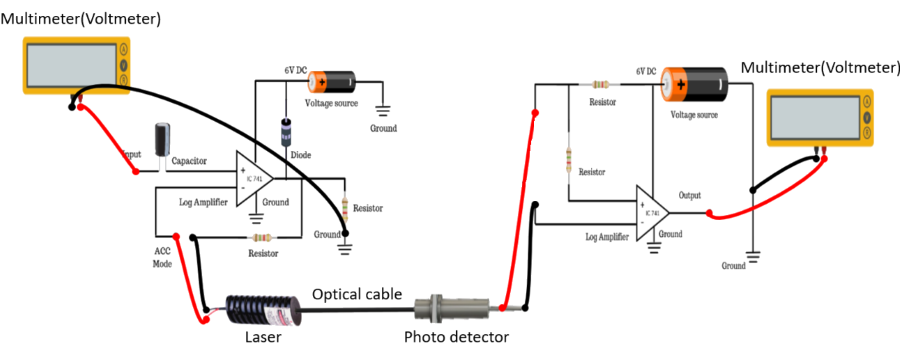

## Procedure 

To perform the experiment:  
  
1.  Connect the 2-metre PMMA FO cable (cab 1) to TX Unit and couple the laser light to the power meter on the RX unit as shown. Select ACC mode of operation.
2.  Set DMM1 to the 2000 mV range and on the RX side connect to the terminals marked (Po) to it . Turn it on. The power meter is now ready for use. Po= (reading)/10 dBm.
3.  Set DMM2 to the 2000 mV range and connect it between Vo and GND on the TX unit. (If = Vo/100).
4.  Gradually increase (Vin). Note (If) and (Po) readings.
5.  Plot the graph Po Vs. log If.
6.  Determine the slopes prior to lasing and after lasing. Record the laser threshold current.

  

**Figure 1: Set up for Characterisation of Laser Diode**  

