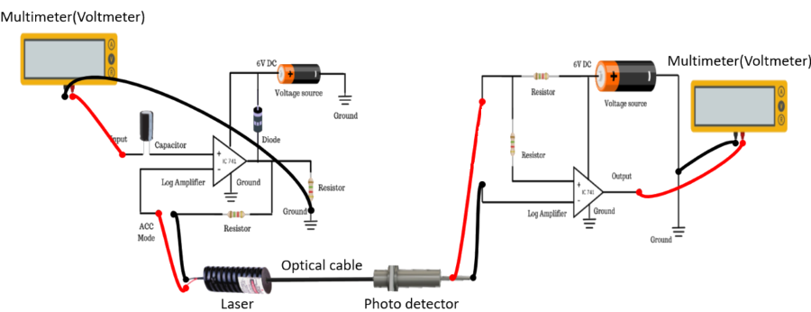

### Introduction

Diode lasers have been called “wonderful little devices.” They are small and efficient. The laser operation occurs at a p-n junction that is the boundary region between p-type and n-type materials. Such a junction can serve as a rectifying diode for electrical circuits, but it is also the critical region for laser operation. In the neighborhood of the junction, the energy bands undergo a shift. An energy barrier restricts electrons in the conduction band from flowing to the right or holes in the valence band from flowing to the left. Thus the junction has electrical rectification properties. Figure 1 shows the output characteristics of a laser diode as a function of input current. At low values of the input, the device acts as a light-emitting diode (LED), producing a relatively small amount of incoherent light. At a threshold value, where the population inversion is large enough so that gain by stimulated emission can overcome the losses, the coherent light is emitted. As current increases above the threshold value, the light output increases much more rapidly than in the LED region. Ideally, the light output should increase linearly with current.

  
  
**Figure 1: Set up for Characterisation of Laser Diode**

